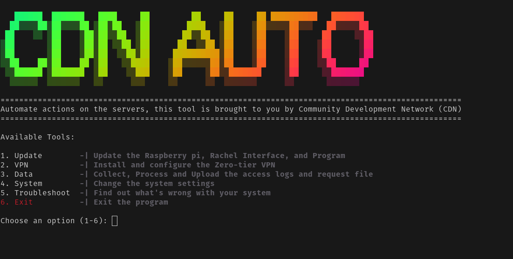

<h1 align="center"> Rachel Auto Tool </h1>

> This is a tool to automate some of the basic tasks done on the Rachel Pi. It is designed to be run on a Raspberry Pi running the CDN Rachel but will still work on any Rachel OS. It is not designed to be run on a Windows machine.

<!-- Image -->
<p align="center">
  
</p>

## Installation
```
git clone https://github.com/ComDevNet/rachel-auto.git
cd rachel-auto
chmod +x install.sh
./install.sh
``` 

## Usage
```
./main.sh
```
## Things Automated
- [x] Update the system
- [x] Update the Rachel Interface
- [x] Update Script
- [x] Connect VPN
- [x] Check VPN Status
- [x] Change Interface (git branching)
- [x] System Configuration
- [x] Shutdown System
- [x] Reboot System
- [x] Collect Logs
- [x] Process Logs
- [x] Collect Content Request File
- [x] Disconnect from VPN Network
- [ ] Upload Data to Server
